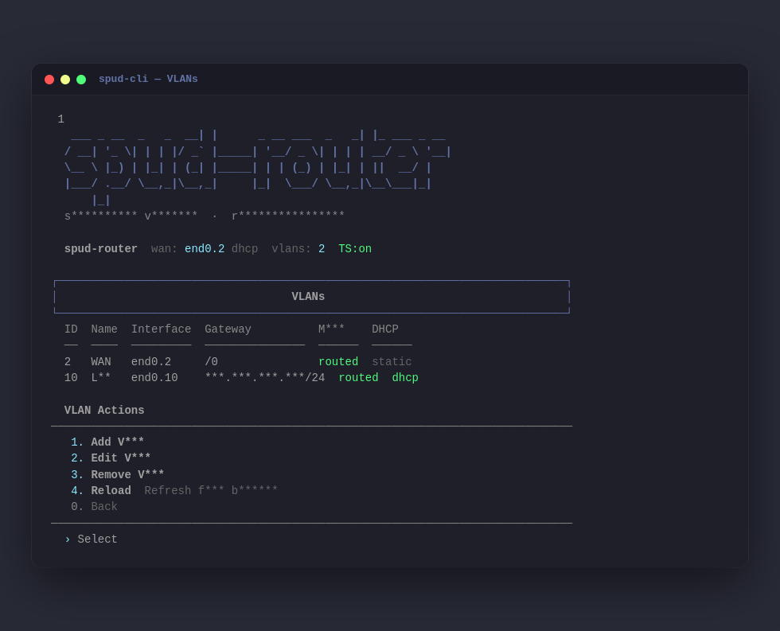

# 🥔 spud-router

A self-hosted router-on-a-stick with a web UI, built for the [Le Potato](https://libre.computer/products/aml-s905x-cc/) (or any ARM SBC running Armbian/Ubuntu). Manages 802.1Q VLANs, DHCP, DNS, firewall rules, static routes, and Tailscale — all from a browser.




> **⚠️ Disclaimer:** Let's be real: this entire project was coded by AI. If you came here expecting a pristine, enterprise-grade, hyper-optimized networking masterpiece... yeah, wrong place. It's called spud_router for a reason. It is, for all intents and purposes, a potato.
> 
> I built it because I needed a router for a simple use case on a 100 Mbps Starlink plan. I had a potato lying around and an idea to write a quick script using standard Linux networking commands. Then I took that idea way, way too far, and now we are here.
> 
> I've tested a few basic features, and honestly? It might work. I even had a decent model check it over for security — it found some things, and it fixed them. So we've got that going for us.
> 
> If you hook it up and it immediately catches fire, or you somehow turn it into a paperweight... look, don't panic. Just submit an issue and I will literally have an AI agent on the cheapest model possible read it, probably mess it up three times, then maybe have a slightly better model patch up this beautiful disaster.
> 
> And if it actually does work? Drop me a line and we can exchange a couple of messages about how absolutely surprised we both are.

---

## Features

- **Router-on-a-stick** — 802.1Q VLAN subinterfaces on a single trunk port
- **Per-VLAN DHCP** — dnsmasq scopes per VLAN, configurable range and lease time
- **VLAN isolation** — block inter-VLAN routing per VLAN with one toggle
- **Firewall management** — inbound rules per VLAN and an inter-VLAN access matrix; auto-mesh and explicit-only modes
- **Custom DNS entries** — local A records (e.g. `nas`, `proxmox`) resolving across all VLANs
- **Static routes** — per VLAN subinterface or global
- **Tailscale integration** — enable/disable, advertise subnets, exit node, live peer status
- **Management interface** — untagged access port so a laptop plugged directly into the trunk port gets DHCP and can reach the web UI immediately — no switch config needed
- **WAN** — DHCP or static; upstream DNS auto from the WAN DHCP lease, or set manually
- **Config export/import** — zip backup of full state + generated configs; restore from JSON
- **Config preview** — view generated netplan, dnsmasq, iptables, and hostapd config before applying
- **Shell CLI** — full-featured interactive TUI over SSH; launches automatically when the `spud` user logs in. Feature parity with the web UI
- **SSH banner + MOTD** — ASCII art logo shown on connect; live status panel (WAN IP, VLAN count, leases, uptime) shown after login

---

## Hardware

| Component | Recommendation |
|-----------|---------------|
| SBC | [Le Potato (AML-S905X-CC)](https://libre.computer/products/aml-s905x-cc/) |
| OS | [Armbian minimal](https://www.armbian.com/lepotato/) (Ubuntu 22.04 or 24.04) |
| Storage | microSD ≥ 8GB (Class 10 / A1) |
| Switch | Any 802.1Q managed switch (Netgear GS308E, TP-Link TL-SG108E, etc.) |

---

## Install

### 1. Flash Armbian

Download Armbian minimal for Le Potato, flash to microSD, boot, and SSH in as root.

### 2. Download the latest release

```bash
curl -L "$(curl -fsSL https://api.github.com/repos/bensonbrett/spud_router/releases/latest \
  | grep browser_download_url | grep '\.tar\.gz' | head -1 | cut -d '"' -f 4)" | tar xz
```

Or download a specific version:

```bash
curl -L https://github.com/bensonbrett/spud_router/releases/download/v1.0.0/spud-router-v1.0.0.tar.gz \
  | tar xz
```

### 3. Run the installer

```bash
sudo bash install.sh
```

The installer:
- Installs system deps (`dnsmasq`, `iptables-persistent`, `vlan`, `netplan`, `fail2ban`, `python3`)
- Disables `NetworkManager`; runs `systemd-resolved` with its stub listener off (`DNSStubListener=no`) so dnsmasq owns port 53 while resolved still learns upstream DNS from the WAN DHCP lease
- Creates a Python venv at `/opt/spud-router/venv`
- Copies the `backend/` app and the built UI to `/opt/spud-router/`
- Prompts for admin credentials (min 12 chars)
- Enables and starts the `spud-router` systemd service
- Hardens SSH, configures fail2ban
- Persists IP forwarding via `/etc/sysctl.d/99-spud-router.conf`
- Writes a bootstrap netplan + dnsmasq config so the management interface works immediately
- Pre-populates WAN (VLAN 2) and LAN (VLAN 10) — click Apply to activate
- Installs Tailscale (run `tailscale up` once to authenticate)

### 4. Connect

Plug a laptop into the Le Potato's LAN port (untagged):

- Laptop gets `192.168.1.100–150` via DHCP
- Open **http://192.168.1.1:8080**
- Sign in with credentials set during install

### 5. Apply

The router ships with a sensible default layout. Click **⚡ Apply** to activate it:

| Network | Interface | IP | DHCP |
|---------|-----------|----|------|
| Management (untagged) | `eth0` | `192.168.1.1/24` | `192.168.1.100-150` |
| WAN (VLAN 2) | `eth0.2` | DHCP from ISP | — |
| LAN (VLAN 10) | `eth0.10` | `192.168.10.1/24` | `192.168.10.100-200` |

Then plug the Le Potato into a managed switch trunk port. Configure the switch so VLAN 2 connects to your modem (WAN), and VLAN 10 is your LAN.

You can add more VLANs, firewall rules, DNS entries, and routes from the web UI — no SSH needed.

### 6. SSH CLI access

```bash
ssh spud@192.168.1.1
```

Logs you straight into the interactive TUI — same features as the web UI. The `spud` user's shell is `spud-cli`, so the menu launches automatically on login.

---

## Managed Switch Setup

| Switch port | Mode | VLANs |
|-------------|------|--------|
| Port 1 → Le Potato | Trunk | All VLANs tagged (2 = WAN, 10 = LAN, etc.) |
| Port 2 → Modem/ONT | Access | VLAN 2 untagged (WAN) |
| Ports 3–4 (LAN) | Access | VLAN 10 untagged |
| Ports 5+ | Configure as needed via web UI |

---

## Repo Structure

```
spud-router/
├── .github/
│   └── workflows/
│       └── release.yml     # Builds frontend + packages release on git tag
├── backend/
│   ├── main.py             # FastAPI backend
│   ├── spud-cli            # Interactive shell TUI (Python, no dependencies)
│   ├── ssh-banner          # ASCII banner shown before SSH password prompt
│   └── motd                # Dynamic MOTD script (status after login)
├── frontend/
│   ├── index.html          # Vite HTML entry
│   ├── package.json
│   ├── vite.config.js
│   └── src/
│       ├── main.jsx
│       └── App.jsx
├── docs/
│   └── images/
│       ├── web-ui.png
│       └── tui.png
├── install.sh
├── .gitignore
└── README.md
```

**Release tarball contents** (built by CI, not committed):
```
spud-router-v1.0.0.tar.gz
├── install.sh
├── backend/         (FastAPI app, generators, CLI)
├── spud-cli
├── ssh-banner
├── motd
├── index.html
├── assets/          (Vite JS/CSS chunks)
└── VERSION
```

---

## Releasing a New Version

```bash
git tag v1.1.0
git push origin v1.1.0
```

GitHub Actions will:
1. Build the frontend (`npm ci && npm run build`)
2. Package `install.sh` + `backend/` + built `dist/` into `spud-router-v1.1.0.tar.gz`
3. Create a GitHub Release with the tarball attached

---

## Development

### Backend

```bash
# from the repo root — the app is the `backend` package
python3 -m venv backend/venv && source backend/venv/bin/activate
pip install fastapi "uvicorn[standard]"
uvicorn backend.main:app --reload --port 8080
```

### Frontend

```bash
cd frontend
npm install
npm run dev       # Dev server on :3000, proxies /api → localhost:8080
```

The Vite dev server proxies all `/api` requests to the backend — no mock data or special config needed. Just run both and open `http://localhost:3000`.

### Deploying an update to an existing install

```bash
# Backend only — no rebuild needed
scp -r backend/* root@<potato-ip>:/opt/spud-router/backend/
ssh root@<potato-ip> systemctl restart spud-router

# Frontend only — build first, then copy
cd frontend && npm run build
scp ../dist/index.html root@<potato-ip>:/opt/spud-router/static/index.html
scp -r ../dist/assets/ root@<potato-ip>:/opt/spud-router/static/
# No restart needed
```

---

## Service Management

```bash
systemctl status spud-router
journalctl -u spud-router -f
systemctl restart spud-router

# Config files written by Apply:
/etc/netplan/50-spud-router.yaml
/etc/dnsmasq.d/spud-router.conf
/etc/spud-router/iptables.sh
/etc/hostapd/hostapd.conf       # only when wireless is enabled

# Persisted kernel settings:
/etc/sysctl.d/99-spud-router.conf   # IP forwarding
/etc/iptables/rules.v4              # iptables restored on boot

# State and credentials:
/etc/spud-router/state.json
/etc/spud-router/auth.json      # chmod 600
```

---

## Troubleshooting

**Can't reach web UI after install**
- Check: `ip addr show eth0` — should have `192.168.1.1/24`
- Check: `systemctl status spud-router`
- Logs: `journalctl -u spud-router -n 50`

**dnsmasq won't start**
- Port 53 conflict: `ss -tulnp | grep :53`
- If `systemd-resolved` is holding port 53, its stub listener should be off: confirm `DNSStubListener=no` in `/etc/systemd/resolved.conf.d/spud-router.conf`, then `systemctl restart systemd-resolved`

**netplan apply fails**
- Debug: `netplan generate --debug`
- Config: `/etc/netplan/50-spud-router.yaml`

**VLANs not working**
- Check module: `lsmod | grep 8021q` — if missing: `modprobe 8021q`
- Check interfaces: `ip -br link | grep eth0`

**Tailscale won't authenticate**
- Run `tailscale up` manually once (requires browser for first auth)

---

## License

[GNU Affero General Public License v3.0 (AGPL-3.0)](https://www.gnu.org/licenses/agpl-3.0.html) — see [LICENSE](LICENSE).

spud_router is free software: anyone may use, study, modify, and share it. Any derivative — including a modified version offered to others over a network — must be released under the same license with its source available, so the project stays free forever.
