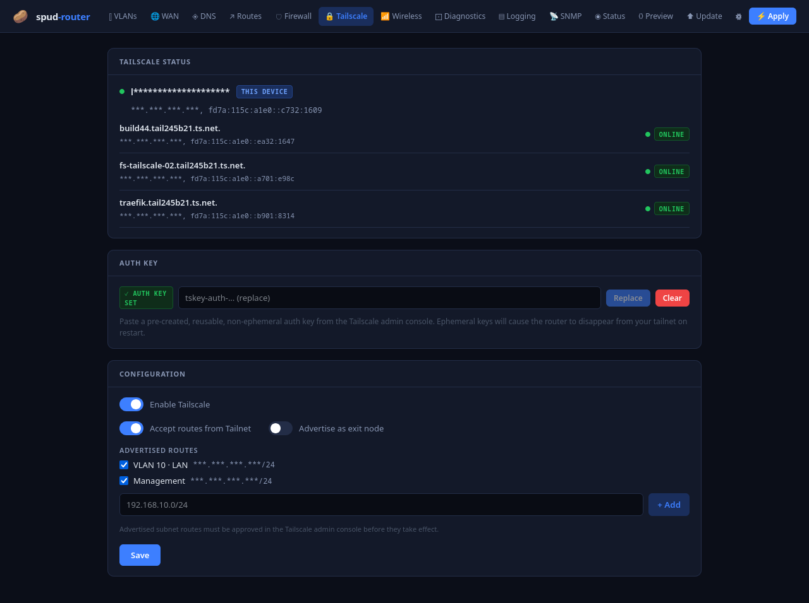
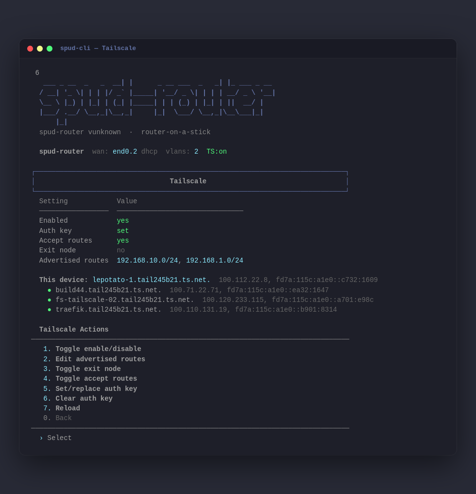

# 🥔 spud-router

A self-hosted router-on-a-stick with a web UI, built for the [Le Potato](https://libre.computer/products/aml-s905x-cc/) (or any ARM SBC running Armbian/Ubuntu). Manages 802.1Q VLANs, DHCP, DNS, firewall rules, static routes, and Tailscale — all from a browser.


<details>
<summary>📸 All screenshots (click to expand)</summary>

### Web UI

| Tab | Screenshot |
|-----|------------|
| VLANs |  |
| WAN |  |
| DNS |  |
| Routes |  |
| Firewall |  |
| Tailscale |  |
| Wireless |  |
| Diagnostics |  |
| Logging |  |
| SNMP |  |
| Status |  |
| Preview |  |
| Update |  |
| Settings |  |

### TUI (spud-cli)

| Screen | Screenshot |
|--------|------------|
| VLANs |  |
| WAN |  |
| DNS |  |
| Routes |  |
| Firewall |  |
| Tailscale |  |
| Wireless |  |
| Syslog |  |
| SNMP |  |
| Status |  |

</details>

> **⚠️ Disclaimer:** Let's be real: this entire project was coded by AI. If you came here expecting a pristine, enterprise-grade, hyper-optimized networking masterpiece... yeah, wrong place. It's called spud_router for a reason. It is, for all intents and purposes, a potato.
> 
> I built it because I needed a router for a simple use case on a 100 Mbps Starlink plan. I had a potato lying around and an idea to write a quick script using standard Linux networking commands. Then I took that idea way, way too far, and now we are here.
> 
> I've tested a few basic features, and honestly? It might work. I even had a decent model check it over for security — it found some things, and it fixed them. So we've got that going for us.
> 
> If you hook it up and it immediately catches fire, or you somehow turn it into a paperweight... look, don't panic. Just submit an issue and I will literally have an AI agent on the cheapest model possible read it, probably mess it up three times, then maybe have a slightly better model patch up this beautiful disaster.
> 
> And if it actually does work? Drop me a line and we can exchange a couple of messages about how absolutely surprised we both are.

---

## Features

### 🌐 Networking

- **Router-on-a-stick** — 802.1Q VLAN subinterfaces on a single trunk port. One cable to a managed switch does WAN, LAN, and everything in between.
- **Per-VLAN DHCP** — dnsmasq scopes per VLAN with configurable range, lease time, gateway, DNS server, and custom DHCP options (NTP, etc.).
- **VLAN isolation** — per-VLAN toggle to block inter-VLAN routing.
- **Static routes** — per-VLAN subinterface or global, with optional description.
- **WAN** — DHCP or static IP; upstream DNS from the WAN lease, manual, or DNS-over-HTTPS (via cloudflared).
- **Management interface** — untagged access port. Plug a laptop into the trunk port and get DHCP + web UI immediately, no switch config needed.
- **Wireless access point** — hostapd-based AP with multiple SSIDs, each bridged to a different VLAN. WPA2, WPA3, or mixed mode; 2.4/5 GHz; hidden SSIDs.

### 🛡️ Firewall

- **Inbound rules** — per-VLAN allow/drop by protocol, port, or ICMP type, with common port presets (SSH, HTTP, DNS, RDP, SMB…).
- **Inter-VLAN access matrix** — visual table of which VLANs can talk to which. Auto-mesh mode (all open by default) or explicit-only (default-deny, add rules to open holes).
- **Outbound (egress) rules** — per-VLAN allow/deny with optional destination CIDR, plus a configurable default policy (allow or deny).
- **ICMP support** — ping is a first-class protocol in all rule types, with named type presets (echo-request, destination-unreachable, etc.).
- **NAT masquerade** — SNAT/PAT on WAN so LAN clients share the WAN IP. Tailscale SNAT so LAN traffic forwarded to the tailnet appears from the router's Tailscale IP.

### 📡 DNS

- **dnsmasq DNS server** — automatic on all LAN interfaces, with the `.lan` domain.
- **Custom A records** — add local DNS entries (e.g. `nas`, `proxmox`) resolvable across all VLANs.
- **DNS-over-HTTPS** — upstream DNS via cloudflared proxy-dns. Providers: Cloudflare, Quad9, Google, or custom URL.
- **WAN DNS block** — optionally block plaintext DNS (port 53) to WAN when DoH is active, with a fail-safe to prevent DNS outage if cloudflared is unhealthy.

### 🔒 Tailscale

- **Enable/disable** — toggle from the web UI or CLI.
- **Auth key support** — write-only, file-fed auth key for headless provisioning.
- **Advertised routes** — auto-populated from your VLAN subnets, plus free-text entries.
- **Exit node** — advertise the router as a Tailscale exit node.
- **Live peer status** — online/offline indicators for all devices on the tailnet.
- **Safe defaults** — `--accept-dns=false` so Tailscale can't hijack the router's DNS.

### 📋 Monitoring

- **Remote syslog** — forward logs to a remote server via UDP, TCP, or TLS, with configurable facility/severity and connectivity test.
- **SNMP agent** — Net-SNMP v2c with read-only and read-write community strings (write-only, never echoed), source IP allowlist, and bind interface.
- **Diagnostics panel** — per-interface carrier/IP status, DHCP lease attribution, PVID hints, and command runner (ping/traceroute/nslookup) — all from the browser or CLI.
- **Status page** — live interfaces, routing table, and DHCP leases in both the web UI and CLI.

### ⚙️ System

- **Config preview** — view generated netplan, dnsmasq, iptables, hostapd, syslog, and SNMP config before applying.
- **Config export/import** — full state + generated configs as a zip backup; restore from JSON with validation.
- **Pending changes detection** — knows when you've made edits but haven't clicked Apply, and tells you.
- **Reboot management** — reboot from the UI or CLI with confirmation. Detects if a reboot is needed and shows a banner.
- **OTA updates** — checks GitHub for new releases, downloads with SHA256 verification, applies with backup + health-gate + auto-rollback on failure. Provisions system dependencies so new features work without re-running the installer.
- **TLS certificate management** — upload a new cert or regenerate the self-signed one from the UI.

### 🖥️ Shell CLI (spud-cli)

- **Full interactive TUI** over SSH — feature parity with the web UI. Launches automatically when the `spud` user logs in. Zero pip dependencies — pure Python stdlib.
- **SSH banner + MOTD** — ASCII art logo on connect; live status panel (WAN IP, VLAN count, leases, uptime) after login.

### 🔐 Security

- **Stateless HMAC-signed session tokens** that survive service restarts and reboots.
- **httpOnly session cookies** — no JavaScript-accessible storage. SameSite=Strict.
- **scrypt password hashing** — transparently upgrades legacy SHA-256 hashes on first login.
- **Login rate limiting** — 5 attempts per 60 seconds per IP.
- **Privilege separation** — the backend runs as an unprivileged user with granular sudoers grants, not `NOPASSWD: ALL`.
- **Self-signed TLS** out of the box — no cert-procurement step during install.

---

## Hardware

| Component | Recommendation |
|-----------|---------------|
| SBC | [Le Potato (AML-S905X-CC)](https://libre.computer/products/aml-s905x-cc/) |
| OS | [Armbian minimal](https://www.armbian.com/lepotato/) (Ubuntu 22.04 or 24.04) |
| Storage | microSD ≥ 8GB (Class 10 / A1) |
| Switch | Any 802.1Q managed switch (Netgear GS308E, TP-Link TL-SG108E, etc.) |

---

## Install

### 1. Flash Armbian

Download Armbian minimal for Le Potato, flash to microSD, boot, and SSH in as root.

### 2. Download the latest release

```bash
curl -L "$(curl -fsSL https://api.github.com/repos/bensonbrett/spud_router/releases/latest \
  | grep browser_download_url | grep '\.tar\.gz' | head -1 | cut -d '"' -f 4)" | tar xz
```

Or download a specific version:

```bash
curl -L https://github.com/bensonbrett/spud_router/releases/download/v1.0.0/spud-router-v1.0.0.tar.gz \
  | tar xz
```

### 3. Run the installer

```bash
sudo bash install.sh
```

The installer:
- Installs system deps (`dnsmasq`, `iptables-persistent`, `hostapd`, `snmpd`, `rsyslog`, `vlan`, `netplan`, `fail2ban`, `python3`)
- Disables `NetworkManager`; runs `systemd-resolved` with its stub listener off (`DNSStubListener=no`) so dnsmasq owns port 53 while resolved still learns upstream DNS from the WAN DHCP lease
- Creates a Python venv at `/opt/spud-router/venv`
- Copies the `backend/` app and the built UI to `/opt/spud-router/`
- Prompts for admin credentials (min 12 chars)
- Enables and starts the `spud-router` systemd service
- Hardens SSH, configures fail2ban — if run while logged in as `root` directly (not via `sudo` from an unprivileged account), it will prompt for a non-root admin username to permit for SSH, so root lockout (`spud`'s shell is the TUI, not bash) can't happen silently
- Persists IP forwarding via `/etc/sysctl.d/99-spud-router.conf`
- Writes a bootstrap netplan + dnsmasq config so the management interface works immediately
- Pre-populates WAN (VLAN 2) and LAN (VLAN 10) — click Apply to activate
- Installs Tailscale (run `tailscale up` once to authenticate)

### 4. Connect

Plug a laptop into the Le Potato's LAN port (untagged):

- Laptop gets `192.168.1.100–150` via DHCP
- Open **https://192.168.1.1:8080** (self-signed TLS cert — accept the browser warning)
- Sign in with credentials set during install

### 5. Apply

The router ships with a sensible default layout. Click **⚡ Apply** to activate it:

| Network | Interface | IP | DHCP |
|---------|-----------|----|------|
| Management (untagged) | `eth0` | `192.168.1.1/24` | `192.168.1.100-150` |
| WAN (VLAN 2) | `eth0.2` | DHCP from ISP | — |
| LAN (VLAN 10) | `eth0.10` | `192.168.10.1/24` | `192.168.10.100-200` |

Then plug the Le Potato into a managed switch trunk port. Configure the switch so VLAN 2 connects to your modem (WAN), and VLAN 10 is your LAN.

You can add more VLANs, firewall rules, DNS entries, and routes from the web UI — no SSH needed.

### 6. SSH CLI access

```bash
ssh spud@192.168.1.1
```

Logs you straight into the interactive TUI — same features as the web UI. The `spud` user's shell is `spud-cli`, so the menu launches automatically on login.

> **Note:** SSH is only permitted on the management interface and over Tailscale by default — not on LAN VLANs. To allow SSH from a LAN VLAN, add an inbound `tcp/22` rule for that VLAN in the web UI's Firewall tab.

---

## Managed Switch Setup

| Switch port | Mode | VLANs |
|-------------|------|--------|
| Port 1 → Le Potato | Trunk | All VLANs tagged (2 = WAN, 10 = LAN, etc.) |
| Port 2 → Modem/ONT | Access | VLAN 2 untagged (WAN) |
| Ports 3–4 (LAN) | Access | VLAN 10 untagged |
| Ports 5+ | Configure as needed via web UI |

---

## Repo Structure

```
spud-router/
├── .claude/
│   └── skills/              # Reusable agent skills
│       ├── install-test/     #   Deploy + test on hardware
│       └── screenshot-docs/  #   Refresh documentation screenshots
├── backend/
│   ├── main.py               # FastAPI backend entrypoint
│   ├── auth.py               # Stateless HMAC session auth
│   ├── state.py              # State persistence (state.json)
│   ├── models.py             # Pydantic models
│   ├── apply_core.py         # Config generation + activation
│   ├── priv.py               # Privilege helper (conditional sudo)
│   ├── tailscale_apply.py    # Tailscale config logic
│   ├── update.py             # OTA update engine
│   ├── spud-cli              # Interactive shell TUI
│   ├── ssh-banner            # ASCII banner before SSH prompt
│   ├── motd                  # Dynamic MOTD (status after login)
│   ├── routers/              # FastAPI route handlers
│   │   ├── auth.py
│   │   ├── config.py
│   │   ├── diagnostics.py
│   │   ├── dns.py
│   │   ├── firewall.py
│   │   ├── snmp.py
│   │   ├── syslog.py
│   │   ├── tailscale.py
│   │   ├── update.py
│   │   ├── vlans.py
│   │   ├── wan.py
│   │   ├── wireless.py
│   │   └── routes.py
│   ├── cli/                  # spud-cli package (stdlib only)
│   │   ├── main.py
│   │   ├── api.py
│   │   ├── ui.py
│   │   └── tabs/             #   One module per CLI screen
│   ├── generators/           # Config file generators
│   │   ├── netplan.py
│   │   ├── dnsmasq.py
│   │   ├── iptables.py
│   │   ├── hostapd.py
│   │   ├── syslog.py
│   │   ├── snmp.py
│   │   └── cloudflared.py
│   └── tests/                # pytest suite
├── frontend/                 # React SPA (Vite)
│   ├── index.html
│   ├── package.json
│   ├── vite.config.js
│   └── src/
│       ├── main.jsx
│       ├── App.jsx           # Tab routing + global UI
│       ├── api.js            # Fetch wrapper with cookie auth
│       ├── components/       # Shared UI components
│       └── tabs/             # One module per tab
├── deploy/                   # Install-time assets
│   ├── sudoers               # Granular sudo grants
│   ├── packages              # Apt dependency manifest
│   └── spud-commit.sh        # Apply confirm/rollback helper
├── docs/
│   └── images/               # Screenshots (see collapsible gallery above)
├── install.sh
├── .gitignore
└── README.md
```

**Release tarball contents** (built by CI, not committed):
```
spud-router-v1.0.0.tar.gz
├── install.sh
├── backend/            (FastAPI app, generators, CLI)
├── spud-cli
├── ssh-banner
├── motd
├── update.py
├── run-update.sh
├── deploy/             (sudoers, packages, spud-commit.sh)
├── index.html          (built frontend)
├── assets/             (Vite JS/CSS chunks)
└── VERSION
```

---

## Releasing a New Version

```bash
git tag v1.1.0
git push origin v1.1.0
```

GitHub Actions will:
1. Build the frontend (`npm ci && npm run build`)
2. Package `install.sh` + `backend/` + built `dist/` into `spud-router-v1.1.0.tar.gz`
3. Create a GitHub Release with the tarball attached

---

## Development

### Backend

```bash
# from the repo root — the app is the `backend` package
python3 -m venv backend/venv && source backend/venv/bin/activate
pip install fastapi "uvicorn[standard]"
uvicorn backend.main:app --reload --port 8080
```

### Frontend

```bash
cd frontend
npm install
npm run dev       # Dev server on :3000, proxies /api → localhost:8080
```

The Vite dev server proxies all `/api` requests to the backend — no mock data or special config needed. Just run both and open `http://localhost:3000`.

### Deploying an update to an existing install

```bash
# Backend only — no rebuild needed
scp -r backend/* root@<potato-ip>:/opt/spud-router/backend/
ssh root@<potato-ip> systemctl restart spud-router

# Frontend only — build first, then copy
cd frontend && npm run build
scp ../dist/index.html root@<potato-ip>:/opt/spud-router/static/index.html
scp -r ../dist/assets/ root@<potato-ip>:/opt/spud-router/static/
# No restart needed
```

---

## Service Management

```bash
systemctl status spud-router
journalctl -u spud-router -f
systemctl restart spud-router

# Config files written by Apply:
/etc/netplan/50-spud-router.yaml
/etc/dnsmasq.d/spud-router.conf
/etc/spud-router/iptables.sh
/etc/hostapd/hostapd.conf               # only when wireless is enabled
/etc/rsyslog.d/60-spud-router-remote.conf
/etc/snmp/snmpd.conf
/etc/systemd/system/cloudflared-doh.service

# Persisted kernel settings:
/etc/sysctl.d/99-spud-router.conf       # IP forwarding
/etc/iptables/rules.v4                  # iptables restored on boot

# State and credentials:
/etc/spud-router/state.json
/etc/spud-router/auth.json              # chmod 600
/etc/spud-router/token-secret           # HMAC signing key, chmod 600
```

---

## Troubleshooting

**Can't reach web UI after install**
- Check: `ip addr show eth0` — should have `192.168.1.1/24`
- Check: `systemctl status spud-router`
- Logs: `journalctl -u spud-router -n 50`

**dnsmasq won't start**
- Port 53 conflict: `ss -tulnp | grep :53`
- If `systemd-resolved` is holding port 53, its stub listener should be off: confirm `DNSStubListener=no` in `/etc/systemd/resolved.conf.d/spud-router.conf`, then `systemctl restart systemd-resolved`

**netplan apply fails**
- Debug: `netplan generate --debug`
- Config: `/etc/netplan/50-spud-router.yaml`

**VLANs not working**
- Check module: `lsmod | grep 8021q` — if missing: `modprobe 8021q`
- Check interfaces: `ip -br link | grep eth0`

**Tailscale won't authenticate**
- Run `tailscale up` manually once (requires browser for first auth), or set an auth key in the web UI or CLI

**Outbound (egress) firewall is blocking traffic I want**
- Check the default outbound policy in the Firewall tab — if set to "deny", add explicit allow rules for the traffic you need
- Outbound rules are evaluated in list order; first match wins
- Management interface egress to WAN is always allowed (can't lock out admin access)

**Wireless AP won't start**
- Check: `iw dev` to confirm your wireless interface supports AP mode
- Check: `systemctl status hostapd`
- Verify the country code is set correctly (`iw reg set <CC>`)
- Some USB adapters require `nl80211` — check `iw phy` output

**Cloudflared / DoH not working**
- Check: `systemctl status cloudflared-doh`
- Logs: `journalctl -u cloudflared-doh -n 30`
- Confirm DNS mode is set to "DoH" in the WAN tab and cloudflared shows `Ready to serve requests...`
- The router will fall back to direct DNS if cloudflared is unhealthy (built-in fail-safe)

**SNMP not responding**
- Check: `systemctl status snmpd`
- Verify the allowlist includes your monitoring host's IP
- If you changed the bind interface, confirm the interface is up
- Test locally: `snmpwalk -v2c -c <community> 127.0.0.1`

**Remote syslog not forwarding**
- Check: `systemctl status rsyslog`
- Use the "Test Connection" button in the web UI's Logging tab (UDP: sends a test message; TCP/TLS: attempts a socket connection)
- Verify the remote server is reachable and listening on the configured port/protocol

**OTA update failed**
- Check: `journalctl -u spud-router-update -n 50` (the transient update unit)
- The update engine automatically rolls back on failure — confirm the previous version is running via `GET /api/health`
- Manual fallback: SSH in and run `sudo python3 /opt/spud-router/update.py --apply`
- To revert manually: `sudo python3 /opt/spud-router/update.py --revert`

**Can't SSH from a device on a LAN VLAN**
- This is the default, not a bug: SSH is only permitted on the management interface and over Tailscale. Add an inbound `tcp/22` rule for that VLAN in the web UI's Firewall tab to allow it.

**TLS certificate warning in browser**
- The default install generates a self-signed cert — this is expected
- To upload a trusted cert (e.g. from Let's Encrypt), use the TLS Certificate section in the Settings tab
- Or regenerate a new self-signed cert from the same panel

---

## License

[GNU Affero General Public License v3.0 (AGPL-3.0)](https://www.gnu.org/licenses/agpl-3.0.html) — see [LICENSE](LICENSE).

spud_router is free software: anyone may use, study, modify, and share it. Any derivative — including a modified version offered to others over a network — must be released under the same license with its source available, so the project stays free forever.
